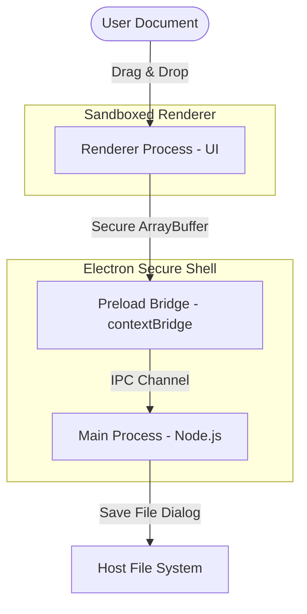

# Security Assessment: PDF Vault (Version 1.0.0)

This document provides a technical security evaluation of **PDF Vault**, a privacy-first offline desktop application for PDF manipulations (merge, split, compress, and page-to-image extraction).

---

## 🛡️ Executive Summary

PDF Vault is designed from the ground up to handle highly confidential and sensitive organizational documents. It operates under a **Zero-Trust, Zero-Network, In-Memory** architecture. 

*   **100% Offline Execution**: The application requires zero internet connection and makes no network requests.
*   **No File Retention**: Documents are processed entirely in-memory (RAM) and are never uploaded, cached, or written to temporary disk storage.
*   **Sandboxed Environment**: Built on Electron with maximum security hardening (Context Isolation and disabled Node Integration in the UI layer).

---

## ⚙️ Technical Architecture & Security Controls

### 1. Process Isolation (Context Isolation & Sandbox)
In standard desktop wrappers, rendering engines are granted direct access to the operating system shell via Node.js integrations, which poses a severe security risk. PDF Vault mitigates this using standard Electron security practices:
*   **`contextIsolation: true`**: The execution context of the web page is completely separated from the preload scripts and Node.js backend. This prevents malicious scripts from accessing internal APIs.
*   **`nodeIntegration: false`**: The client-side UI (Chromium renderer) has **no direct access** to Node.js APIs (`require`, `fs`, `child_process`). It cannot execute system commands, spawn shells, or write directly to disk.
*   **Explicit Preload Bridge**: The renderer communicates with the backend exclusively through a restricted, read-only bridge defined in [preload.js](file:///d:/My%20Work/PDF/preload.js). The only exposed channels are safe, user-triggered filesystem wrappers (`showSaveDialog`, `showDirectoryDialog`, `saveFile`).

### 2. Zero-Network Footprint
An attacker cannot exfiltrate data or establish remote shells because the application does not possess network capability:
*   **No Network Imports**: All libraries (`pdf-lib`, `pdfjs-dist`, and `@quicktoolsone/pdf-compress`) are loaded from local `node_modules` folders. 
*   **No External API Connections**: The app does not initiate any `fetch`, `XMLHttpRequest`, or WebSockets connections.
*   **Static Assets**: The worker files and source code compile locally, eliminating CDN connections.

### 3. Transient Memory Lifecycle (No Disk Leaks)
*   **RAM-Only Parsing**: When a PDF is loaded, it is converted into a standard JavaScript `ArrayBuffer`. Parsing, thumbnail rendering, merging, and image compilation occur purely in transient RAM.
*   **No Temp Files**: Unlike other tools that write intermediate pages to `C:\Users\...\AppData\Local\Temp`, PDF Vault handles splits and compression in-memory.
*   **Automatic Garbage Collection**: Closing the PDF Vault window instantly destroys the main thread and releases the allocated memory buffer back to the operating system.

---

## 🕵️ Threat Modeling & Attack Vectors Analysis

| Threat Vector | Assessment & Mitigation | Risk Level |
| :--- | :--- | :--- |
| **Data Exfiltration / Theft** | **Mitigated**. Because the application runs fully local and does not use any network protocols or outbound connections, it is physically impossible for the app to transmit document contents to any external party. | **Zero** |
| **Reverse Shells / Host Takeover** | **Mitigated**. The renderer process has no shell access or system execute privileges. Files are parsed using pure JS libraries without compiling native binaries. An attacker cannot use a malformed PDF to hijack the host PC. | **Zero** |
| **Supply Chain Compromise** | **Minimised**. The application relies on exactly three production libraries: `pdf-lib` (pure JS parser, zero dependencies), `pdfjs-dist` (maintained by Mozilla), and `@quicktoolsone/pdf-compress` (client-side optimizer). All codes are static and auditable. | **Very Low** |
| **Local Privilege Escalation** | **Mitigated**. The application runs inside the user's standard privileges space and does not request administrator or root execution rights. | **Zero** |

---

## 🧪 Compliance Validation Guide for Security Teams

If your cybersecurity team wishes to audit the application, they can run the following validation scripts:

### 1. Network Activity Audit
Run the application while capturing network packets with **Wireshark** or **Fiddler**:
1.  Launch PDF Vault.
2.  Perform PDF merges, splits, compressions, and image conversions.
3.  Filter packet capture by the app's Process ID (PID).
4.  **Result**: 0 network packets sent/received.

### 2. Filesystem Write Audit
Use **Sysinternals Process Monitor (ProcMon)** to track filesystem interactions:
1.  Set filter to `Process Name is PDF Vault.exe` and `Operation is WriteFile`.
2.  Perform PDF operations.
3.  **Result**: Write operations will only occur when the user explicitly triggers a save dialog and selects a destination folder. No stealthy temporary files are written to system folders.
